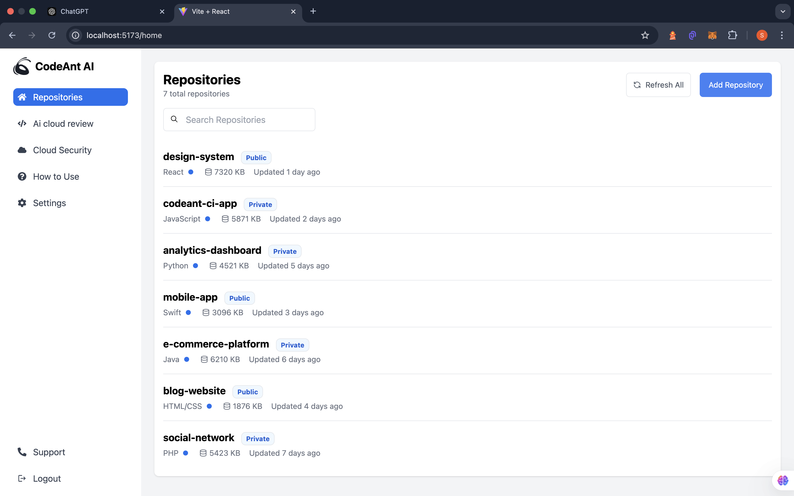
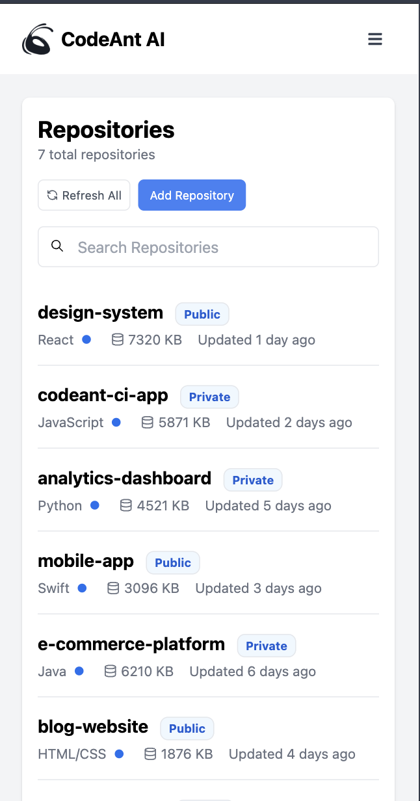
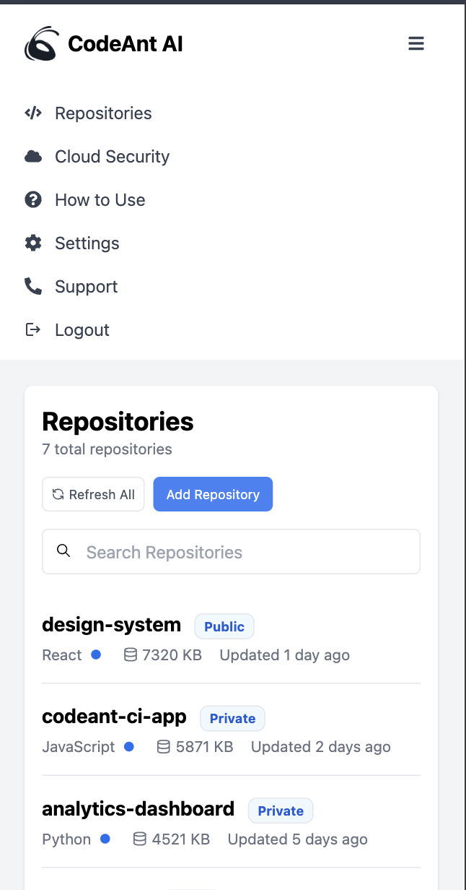
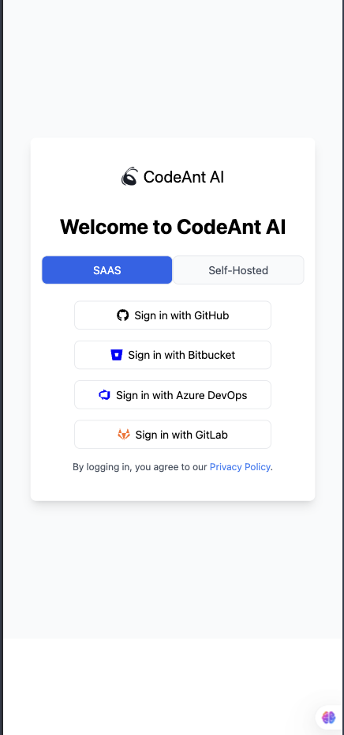
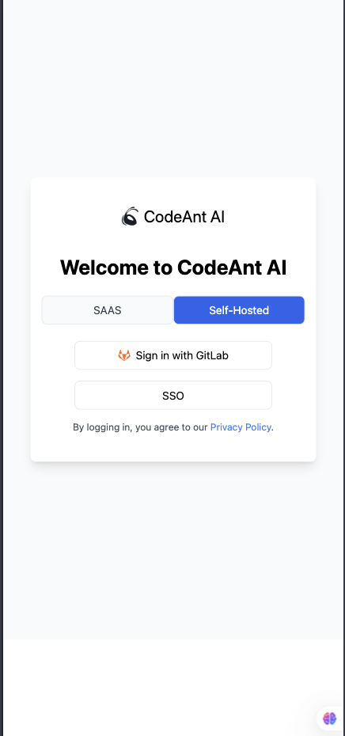

Got it! If the `assets` folder is inside the `src` folder (i.e., `src/assets`), you'll need to update the image paths accordingly in the README.

Here’s the updated version of the `README.md` file with the correct image paths:

### `README.md`

```markdown
# React Frontend Project

This is a React-based frontend for the project. The app is designed to provide a user-friendly interface with various features implemented using React.js and Tailwind CSS.

## Folder Structure

```
frontend/
├── src/
│   ├── assets/
│   │   ├── out1.png
│   │   ├── out2.png
│   │   ├── out3.png
│   │   ├── out4.png
│   │   ├── out5.png
│   │   ├── out6.png
│   │   ├── out7.png
│   ├── components/
│   ├── App.js
│   ├── index.js
│   └── styles/
├── public/
│   └── index.html
├── package.json
├── .gitignore
└── README.md
```

### Description

The `frontend/` directory contains all the frontend code for the React application.

- **src/assets/**: Contains the image assets used throughout the app. Images are named as `out1.png` to `out7.png` and can be found in this folder.

### Images

The following images are included in the `src/assets/` folder:

- 
- 
- 
- 
- 
- 
- 

These images can be used in various components within the app.

### Prerequisites

To run this project, you will need to have Node.js and npm (or Yarn) installed.

- **Node.js**: [Download Node.js](https://nodejs.org/)
- **npm**: npm is bundled with Node.js, but you can install it separately if needed.

### Installation

1. Clone the repository:
   ```bash
   git clone <repository-url>
   cd frontend
   ```

2. Install the required dependencies:
   ```bash
   npm install
   ```

### Usage

To start the development server, run:

```bash
npm run dev
```

This will start the application on `http://localhost:3000`.

### Build

To build the application for production:

```bash
npm run build
```

This will create a `build/` directory containing the optimized production build.

### Contributing

If you would like to contribute to this project, feel free to submit a pull request with any improvements or bug fixes. Be sure to adhere to the following guidelines:

- Use clear and descriptive commit messages.
- Follow the coding conventions used in the project.

### License

This project is open source and available under the [MIT License](LICENSE).
```

### Notes:
1. The images will now point to `src/assets/out1.png`, `src/assets/out2.png`, etc.
2. These image paths assume that the `assets` folder is inside the `src` folder of your project structure.

